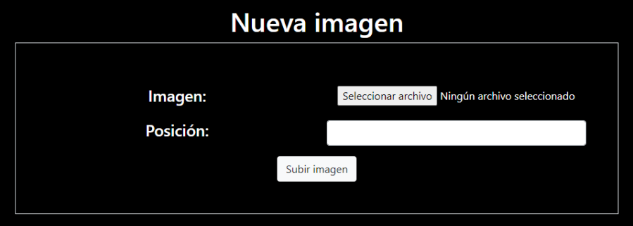
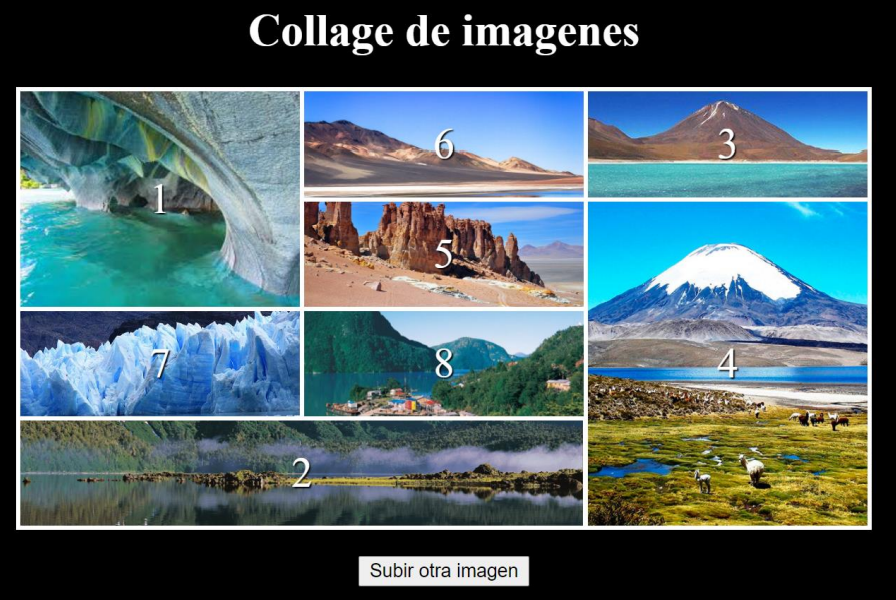

# Desafío - Collage de imágenes

Un fotógrafo profesional de reconocimiento mundial quiere actualizar su sitio web y ha
pensado en agregar una sección que muestre un collage de imágenes con sus mejores fotos.
En este desafío deberás crear un servidor con Express y el paquete express-fileupload para
almacenar las imágenes que estarán dentro del collage.

